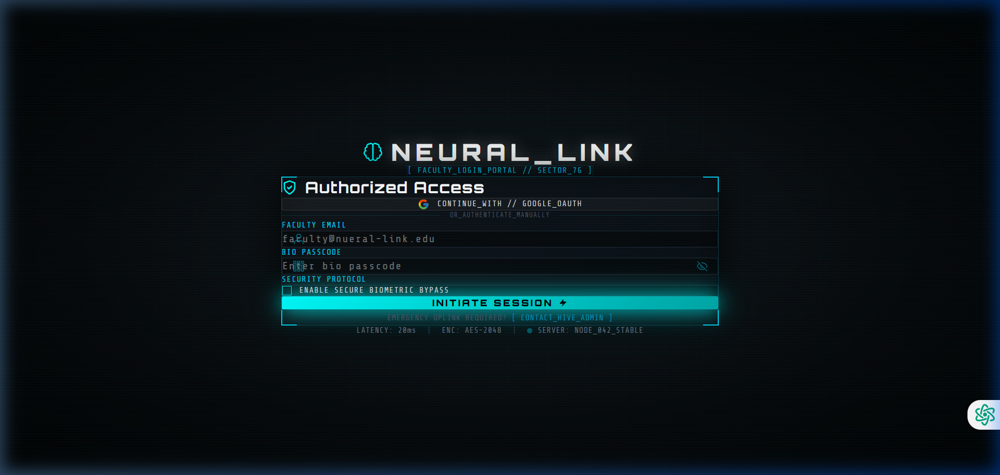
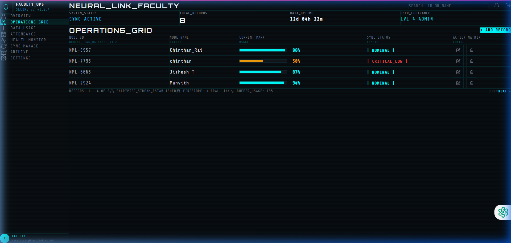
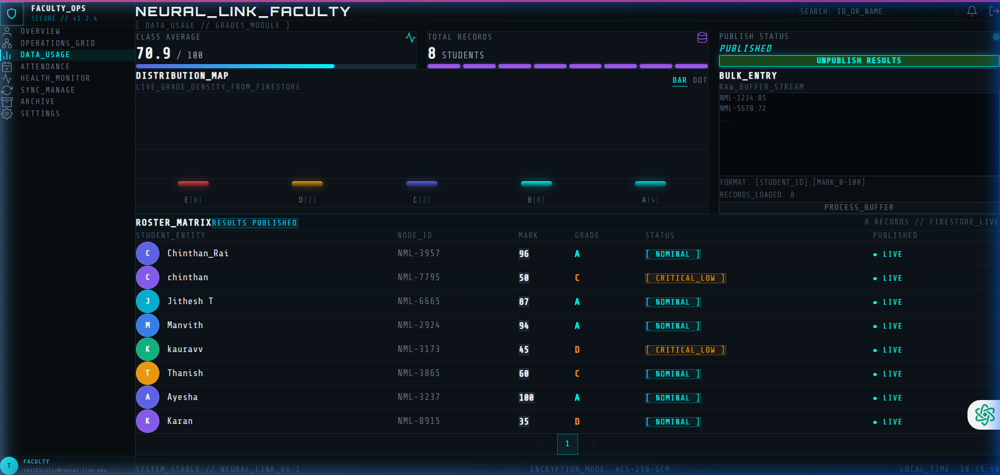
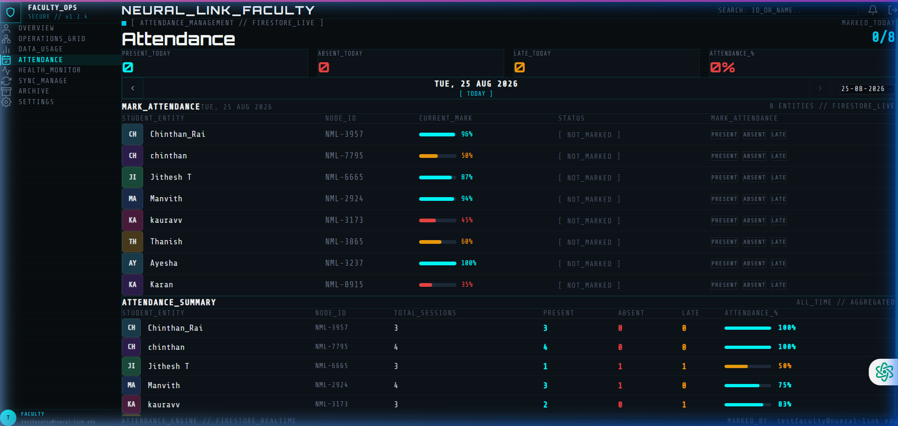

# 🧬 NEURAL_LINK

<div align="center">

### SECURE FACULTY OPERATIONS & STUDENT MANAGEMENT PORTAL

A real-time faculty administration dashboard for managing student records, grades, attendance, synchronization workflows, and archival data — built with React, Firebase, and Tailwind CSS.

<br/>


<br/>


</div>

---

## 🚀 Live Application

**Production deployment:**
👉 https://neural-link-gamma.vercel.app/

NEURAL_LINK is deployed as a production web application using **Vercel**, with **Firebase Authentication** and **Cloud Firestore** providing the backend services.

> **Note:** Access to administrative functionality requires an authenticated faculty account configured in Firebase Authentication.

---

## 📌 Overview

**NEURAL_LINK** is a modern faculty operations portal designed to centralize student administration into a single real-time interface.

The application combines a futuristic cyberpunk-inspired interface with practical administrative workflows such as:

* Student enrollment management
* Real-time CRUD operations
* Grade processing and publishing
* Attendance tracking
* Database synchronization
* Administrative terminal commands
* Archival data management
* Firebase authentication
* Firestore batch operations

The system is designed around a **real-time data model**, allowing changes made through the dashboard to synchronize with Cloud Firestore without requiring manual page refreshes.

---

## ✨ Why NEURAL_LINK?

Traditional student administration systems often separate student records, grades, attendance, and operational tools across multiple interfaces.

NEURAL_LINK brings these workflows together into one centralized faculty workspace.

### Core design principles

| Principle           | Implementation                            |
| ------------------- | ----------------------------------------- |
| 🔄 Real-time        | Cloud Firestore subscriptions             |
| 🔐 Secure           | Firebase Authentication + Firestore Rules |
| ⚡ Responsive        | React component architecture              |
| 📊 Data-driven      | Live student, grade & attendance metrics  |
| 🧩 Modular          | Feature-specific React pages              |
| 🖥️ Immersive       | Cyberpunk-inspired administrative UI      |
| 🚀 Production-ready | Vercel deployment                         |

---

# ⚡ Key Features

## 🔐 Faculty Authentication

Secure faculty entry powered by Firebase Authentication.

### Supported authentication

* Email / password authentication
* Google OAuth
* Authentication state persistence
* Protected application routes
* Loading and authentication state handling

---

## 🎛️ Student Operations Dashboard

The central dashboard provides real-time student record management.

### CRUD operations

* Create student records
* Read student records
* Update student information
* Delete student records
* Real-time Firestore synchronization
* Student status management
* Publication state tracking
* Timestamp management

Example student record:

```json
{
  "id": "NML-8422",
  "name": "Jane Doe",
  "mark": 84,
  "status": "NOMINAL",
  "published": true,
  "publishedAt": "Timestamp",
  "syncedAt": "Timestamp",
  "createdAt": "Timestamp"
}
```

---

# 📊 Grades Management

The Grades module provides a dedicated interface for processing and publishing student marks.

### Features

* Individual grade management
* Bulk grade processing
* Custom command-style input
* Grade validation
* Automatic grade distribution
* Real-time statistics
* Batch publishing
* Publication state management

### Bulk input format

```text
NML-8422:84
NML-8423:76
NML-8424:91
```

The application processes the input and performs validated Firestore writes using batch operations.

---

# 📅 Attendance Management

NEURAL_LINK provides a calendar-based attendance matrix for faculty members.

### Attendance states

| Status    | Meaning              |
| --------- | -------------------- |
| `PRESENT` | Student attended     |
| `LATE`    | Student arrived late |
| `ABSENT`  | Student was absent   |

### Capabilities

* Date-based attendance
* Calendar navigation
* Individual attendance marking
* Attendance percentage calculation
* Real-time Firestore persistence
* Visual status indicators

Attendance records follow a predictable document structure:

```json
{
  "date": "2026-08-25",
  "studentDocId": "firestore_doc_id",
  "status": "PRESENT",
  "updatedAt": "Timestamp"
}
```

---

# 📟 Administrative Terminal

The Terminal module provides a keyboard-driven command interface for administrative operations and diagnostics.

### Available commands

| Command     | Purpose                           |
| ----------- | --------------------------------- |
| `HELP`      | Display available commands        |
| `STATUS`    | Display system status information |
| `SYNC`      | Synchronize student timestamps    |
| `PUBLISH`   | Publish student records           |
| `UNPUBLISH` | Move records back to staged state |
| `CLEAR`     | Clear terminal output             |
| `PURGE_DB`  | Remove student records            |

Example:

```text
> STATUS

SYSTEM STATUS
-------------
DATABASE     : ONLINE
AUTH         : ACTIVE
SYNC ENGINE  : READY
NODE STATE   : NOMINAL
```

---

# 🔄 Synchronization Manager

The Sync module provides visibility into synchronization operations.

It is designed to represent:

* Firestore synchronization
* Client-side state updates
* Timestamp synchronization
* Replication activity
* Publish operations
* Rollback-oriented workflows

The synchronization interface provides administrators with a centralized operational view.

---

# 🗄️ Archive Vault

The Archive module provides a structured interface for historical and legacy data.

It uses a directory-style interface to represent:

* Historical records
* Cold-storage directories
* Legacy backups
* Archived student information
* System snapshots

This provides the application with a dedicated space for future archival functionality.

---

# 📋 Roster Management

The Roster module provides an overview of the student population.

### Includes

* Student filtering
* Enrollment overview
* Student statistics
* Record distribution
* Operational metrics

---

# 🏗️ System Architecture

```text
                    ┌───────────────────────┐
                    │       NEURAL_LINK     │
                    │    React Frontend     │
                    └───────────┬───────────┘
                                │
              ┌─────────────────┼─────────────────┐
              │                 │                 │
              ▼                 ▼                 ▼
       Firebase Auth      Cloud Firestore      UI State
              │                 │                 │
              │                 │                 │
              ▼                 ▼                 ▼
        Faculty Login       Student Data      React Hooks
                            Attendance
                            Grades
                            Sync State
                                │
                                ▼
                         Batch Operations
                                │
                                ▼
                         Real-time Updates
```

---

# 🛠️ Tech Stack

## Frontend

### React 19

Component-based UI architecture using:

* React Hooks
* Component composition
* Local state management
* Custom refs
* Conditional rendering

### Vite 8

Used as the frontend build tool and development server.

Provides:

* Fast development startup
* Hot Module Replacement
* ES module-based development
* Production bundling

### Tailwind CSS v4

Used for:

* Responsive layouts
* Utility-first styling
* Dashboard components
* Dark UI system
* Cyberpunk visual language

---

## Backend & Data

### Firebase

NEURAL_LINK uses Firebase for backend infrastructure.

Services include:

* Firebase Authentication
* Cloud Firestore
* Real-time document subscriptions
* Batched writes
* Security Rules

---

## Deployment

### Vercel

The production frontend is deployed through Vercel.

**Production URL:**

https://neural-link-gamma.vercel.app/

The application can also be continuously deployed from the GitHub repository through Vercel's Git integration.

---

# 📂 Project Structure

```text
Neural_Link/
│
├── public/
│   └── Static assets
│
├── src/
│   │
│   ├── assets/
│   │   └── Images and local assets
│   │
│   ├── components/
│   │   │
│   │   ├── pages/
│   │   │   ├── ArchivePage.jsx
│   │   │   ├── AttendancePage.jsx
│   │   │   ├── GradesPage.jsx
│   │   │   ├── RosterPage.jsx
│   │   │   ├── SyncPage.jsx
│   │   │   └── TerminalPage.jsx
│   │   │
│   │   ├── Dashboard.jsx
│   │   └── LoginPage.jsx
│   │
│   ├── App.jsx
│   ├── App.css
│   ├── firebase.js
│   ├── index.css
│   └── main.jsx
│
├── firestore.rules
├── vite.config.js
├── package.json
└── README.md
```

---

# 💾 Database Architecture

NEURAL_LINK currently uses Cloud Firestore as its primary data store.

## `students`

Stores the primary student records.

```text
students/
└── {documentId}
```

Example:

```json
{
  "id": "NML-8422",
  "name": "Jane Doe",
  "mark": 84,
  "status": "NOMINAL",
  "published": true,
  "publishedAt": "Timestamp",
  "syncedAt": "Timestamp",
  "createdAt": "Timestamp"
}
```

---

## `attendance`

Stores attendance records for individual students by date.

```text
attendance/
└── {date}_{studentDocId}
```

Example:

```json
{
  "date": "2026-08-25",
  "studentDocId": "firestore_doc_id",
  "status": "PRESENT",
  "updatedAt": "Timestamp"
}
```

---

# 🔒 Security

Security is enforced at the Firebase layer through:

### Firebase Authentication

Only authenticated users can access protected application functionality.

### Firestore Security Rules

Database operations are restricted through Firestore security rules.

The application also validates student marks before database writes.

For example:

```text
Mark >= 0
Mark <= 100
```

### Important

Firebase configuration values that are safe to expose client-side may exist in the frontend configuration, but **private credentials, service-account keys, and sensitive secrets must never be committed to GitHub**.

For production deployments, sensitive configuration should be managed through environment variables and platform configuration.

---

# 🚀 Getting Started

## Prerequisites

Install:

* Node.js 18+
* npm
* Git
* A Firebase project

Check your installation:

```bash
node --version
npm --version
git --version
```

---

## 1. Clone the Repository

```bash
git clone https://github.com/Chinthan17-4/Neural_Link.git
```

Navigate into the project:

```bash
cd Neural_Link
```

---

## 2. Install Dependencies

```bash
npm install
```

---

## 3. Configure Firebase

Create or configure your Firebase project and enable:

* Authentication
* Google Authentication (if required)
* Cloud Firestore

Configure the Firebase client using environment variables.

Example `.env`:

```env
VITE_FIREBASE_API_KEY=your_api_key
VITE_FIREBASE_AUTH_DOMAIN=your_auth_domain
VITE_FIREBASE_PROJECT_ID=your_project_id
VITE_FIREBASE_STORAGE_BUCKET=your_storage_bucket
VITE_FIREBASE_MESSAGING_SENDER_ID=your_messaging_sender_id
VITE_FIREBASE_APP_ID=your_app_id
```

> Never commit `.env` files containing private credentials or secrets.

Add the following to `.gitignore` if necessary:

```gitignore
.env
.env.local
.env.*.local
```

---

## 4. Start Development Server

```bash
npm run dev
```

Vite will provide a local development URL, typically:

```text
http://localhost:5173
```

---

# 🏭 Production Build

Create an optimized production build:

```bash
npm run build
```

Preview the production build locally:

```bash
npm run preview
```

---

# ☁️ Vercel Deployment

NEURAL_LINK is currently deployed on **Vercel**.

### Deployment workflow

```text
GitHub Repository
       │
       ▼
     Vercel
       │
       ▼
 Production Build
       │
       ▼
neural-link-gamma.vercel.app
```

### Deploy your own instance

1. Fork or clone the repository.
2. Create a project in Vercel.
3. Connect the GitHub repository.
4. Configure the Firebase environment variables in Vercel.
5. Deploy the project.

For future deployments, pushes to the connected GitHub branch can trigger automatic deployments through Vercel.

---

# 🧪 Development Commands

| Command           | Description                  |
| ----------------- | ---------------------------- |
| `npm install`     | Install project dependencies |
| `npm run dev`     | Start development server     |
| `npm run build`   | Create production build      |
| `npm run preview` | Preview production build     |

---

# 📈 Current Capabilities

```text
┌─────────────────────────────────────────┐
│          NEURAL_LINK OPERATIONS         │
├─────────────────────────────────────────┤
│                                         │
│  ✓ Faculty Authentication              │
│  ✓ Student CRUD                         │
│  ✓ Real-time Firestore Sync             │
│  ✓ Grade Processing                     │
│  ✓ Bulk Grade Publishing                │
│  ✓ Attendance Management                │
│  ✓ Attendance Percentage Calculation    │
│  ✓ Roster Management                    │
│  ✓ Synchronization Interface            │
│  ✓ Administrative Terminal              │
│  ✓ Archive Interface                   │
│  ✓ Firestore Batch Operations           │
│  ✓ Production Vercel Deployment         │
│                                         │
└─────────────────────────────────────────┘
```

---

# 🗺️ Roadmap

Potential future improvements include:

* [ ] Role-based access control
* [ ] Admin / Faculty permission levels
* [ ] Advanced student search
* [ ] Student profile pages
* [ ] CSV import/export
* [ ] PDF report generation
* [ ] Advanced analytics dashboard
* [ ] Attendance reports
* [ ] Grade history tracking
* [ ] Audit logs
* [ ] Notification system
* [ ] Automated database backups
* [ ] Improved mobile responsiveness
* [ ] Automated testing
* [ ] CI/CD quality checks

---

# 📸 Screenshots

### Login Portal


### Dashboard & Operations Grid


### Grades Matrix


### Attendance Calendar


---

# 🧠 Engineering Highlights

NEURAL_LINK demonstrates practical implementation of several modern frontend and cloud-development concepts:

* Component-driven React architecture
* React state and lifecycle management
* Real-time database subscriptions
* Firebase Authentication
* Cloud Firestore CRUD
* Firestore batch writes
* Client-side validation
* Modular dashboard architecture
* Responsive UI development
* Utility-first CSS
* Production build pipelines
* Git-based deployment
* Vercel hosting

The project is intended to demonstrate how a modern frontend application can be connected to a cloud backend while maintaining a structured and scalable component architecture.

---

# 🤝 Contributing

Contributions, suggestions, and improvements are welcome.

### Basic workflow

```bash
# Create a feature branch
git checkout -b feature/your-feature

# Make your changes

# Commit
git commit -m "feat: add your feature"

# Push
git push origin feature/your-feature
```

Then open a Pull Request.

---

# 📄 License

This project is licensed under the **MIT License**.

See the `LICENSE` file for details.

---

# 👨‍💻 Author

### Chinthan Rai

**NEURAL_LINK**

GitHub:
https://github.com/Chinthan17-4/Neural_Link

Live Application:
https://neural-link-gamma.vercel.app/

---

<div align="center">

### 🧬 NEURAL_LINK

**Faculty Operations • Real-Time Data • Secure Administration**

Built with React + Firebase + Tailwind CSS

<br/>

`SYSTEM STATUS: ONLINE`

</div>
